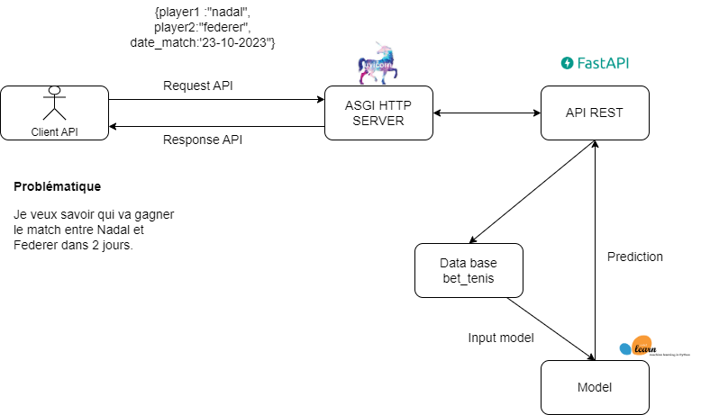

# Projet prédiction vainqueur match de tennis

On peut décomposer l'architecture du projet prédiction du vainqueur d'un match de tennis de la facon suivante:

## Utilisateur

## Serveur

## FastAPI

## DataBase

## Model